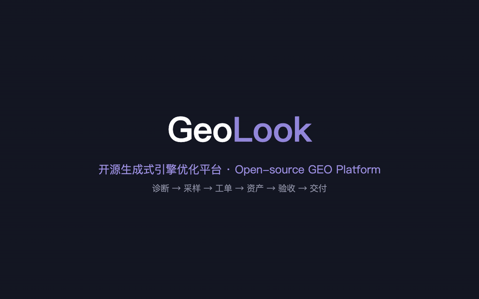
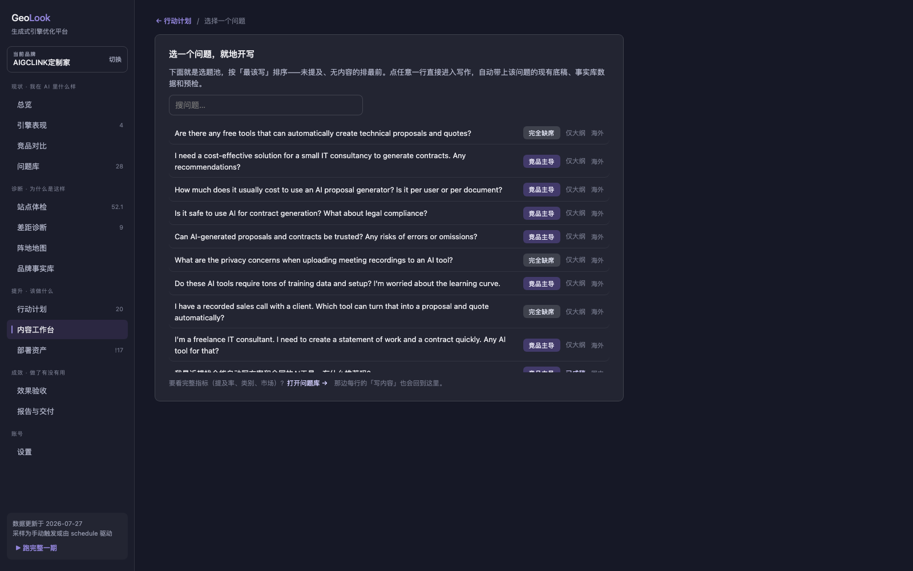

<div align="center">

# Geo**Look**

**Open-source, self-hosted platform for end-to-end GEO implementation**

For a specific project: status analysis → diagnosis → strategy → implementation tickets → execution → verification

[简体中文](README.md) · English

   



🌐 [Website geolook.cc](https://geolook.cc) · 🔍 [Live demo (read-only)](https://geolook.cc/demo/) · 📹 [HD demo video (mp4)](docs/demo.mp4) · 🖼 [All screenshots](docs/screenshots/)

<sub>Mirror while DNS propagates: [geolook-three.vercel.app](https://geolook-three.vercel.app) · [demo](https://geolook-three.vercel.app/demo/)</sub>

</div>

> GEO = Generative Engine Optimization: getting AI engines (ChatGPT, Perplexity, Gemini, DeepSeek, Doubao…) to **proactively mention and cite your brand** when answering user questions. Not geographic info, not classic SEO.

## 1. Problems it solves

More and more users ask AI directly — "best tools for X", "X vs Y, which one". If your brand:

| Problem | What GeoLook gives you |
|---|---|
| **AI never mentions you** — you're not in the candidate set for category questions | Samples real answers engine by engine; quantifies mention rate / rank / citation share; diagnoses "absent" vs "competitor-dominated" |
| **You don't know why** — AI is a black box | 6-dimension site audit + gap diagnosis: uncrawlable pages? missing extraction blocks? absent from the channels AI actually cites? inconsistent messaging? |
| **Advice never lands** — recommendations pile up, nobody executes or verifies | Generates implementation tickets with acceptance criteria; 86% auto-verifiable in the sample project (18/21) — "done" is measured, not claimed |
| **Did the work even help?** | Per-question before/after across sampling rounds + task-level before/after |
| **You deliver GEO as a service and packaging is painful** | One click produces diagnosis report, strategy, execution plan, ticket CSV, and acceptance sheet for clients |

## 2. Feature map

Four stages plus operations, all in one self-hosted dashboard:

**Status** — Engine performance across 15 engines (10 automated via API + 5 manual sheets): mention rate, rank, citation share, what each engine actually cites, **sample replay** of raw answers, suspected-negative flags; **brand mention distribution** (you vs. competitors, per engine and aggregated); competitor tables with each rival's strongest engine one click away; a 7-category question bank where every question gets a **diagnosis type** (suspected-negative > competitor-dominated > absent > low-ranked).


**Diagnosis** — Site audit (robots / sitemap / llms.txt / accessibility / language coverage / extraction blocks, with click-through filtering straight to the fixing ticket); gap diagnosis (content → channels → facts); a **channel map of 19 channels** weighted by real citation-corpus data, each specifying what to build, how much, at what cadence, by whom; a **brand facts library** as the single source of truth that llms.txt, JSON-LD and content drafts are generated from.


**Action** — Structured tickets (rationale / owner / effort / window / acceptance criteria) with "first-measured → current → target" progress bars and automatic reopening on regressions; a **content workbench** (topic pool sorted by "not mentioned + no content", required extraction blocks and brand facts at hand, live citability pre-check, fabrication-risk lint for AI drafts, and a **distribution checklist** matching each piece to its target channels); **deploy assets** (llms.txt, JSON-LD, HTML snippets, each labeled with its destination, plus a DEPLOY.md runbook); **publishing** to GitHub / WordPress drafts / WeChat OA drafts / webhook — always manually confirmed.




**Results** — Per-question before/after (all / CN / global tabs), task-level before/after, verification history; boss-ready one-pager, execution plan, and a complete client delivery package (HTML + CSV).

**Operations** — Scheduled full-cycle re-runs (every 7/14/30 days), multi-brand with one-click switching, and a manual-sampling loop (export sheet → fill → re-import) that feeds the same metrics.

## 3. How it differs from other GEO tools

Most GEO products are **monitoring SaaS**: they show mention rates and rankings, charge monthly, and keep your data in their cloud. GeoLook is an **implementation platform**:

| | Typical GEO monitoring SaaS | GeoLook |
|---|---|---|
| **Loop depth** | Monitor + advise | Monitor → diagnose → **tickets → assets → auto-verify → deliver** |
| **Verification** | None (or manual check-off) | Programmatic: re-crawl + next sampling round decide; regressions reopen automatically |
| **Metrics** | Black-box scores | Fully reproducible; a "where do these numbers come from" panel in the UI; unmeasured shows "unmeasured", never faked |
| **Chinese market** | Mostly Western engines | First-class CN engine matrix (GLM / Doubao / DeepSeek / Kimi / MiniMax / Nano / Baidu AI) + CN channels calibrated on citation-corpus data (Baike, ranking sites, WeChat, Toutiao…); CN and Global measured separately |
| **Scoring basis** | Heuristics | Anchored in public empirical data: 602 prompts / 21,143 citations / 187,818 deduplicated CN citations ([references/](references/)) |
| **Data ownership** | Vendor cloud | **Everything on your machine** under `work/` (JSON/Markdown); `git init` is your backup |
| **Cost** | Subscription | Free and open source; you only pay your own engine API sampling costs (can be zero — manual sampling works) |
| **Deliverables** | Dashboard screenshots | Client-ready diagnosis report / strategy / execution plan / ticket CSV — built for agencies and consultants |

Honest limits: single-machine tool, no accounts or team collaboration; sampling frequency and volume depend on your own API budget; "suspected negative" flags are leads for human review, not verdicts. These are deliberate design choices.

## 4. Deployment

### Requirements

- macOS or Linux (Windows via WSL — the code uses `fcntl` file locks)
- Python **3.9+**
- Exactly three third-party packages: `requests`, `beautifulsoup4`, `lxml`

### Three steps

```bash
# 1. Clone and install
git clone https://github.com/bingqiang2021/geolook.git
cd geolook
pip3 install requests beautifulsoup4 lxml

# 2. Start the dashboard (opens your browser)
python3 scripts/geo.py ui        # → http://127.0.0.1:8765

# 3. (Optional) Configure engine API keys
#    A: in the dashboard — Settings → Engines & Keys → "Configure" (writes local .env)
#    B: cp .env.example .env and edit
```

**Zero keys works too**: automated sampling is skipped; use the manual sampling sheet loop instead. Crawling, auditing, tickets and assets need no keys. One CN-capable key (e.g. DeepSeek/GLM) unlocks auto-derivation of the question bank / brand facts and AI first drafts.

### Remote / server deployment

The server binds to `127.0.0.1` only (a deliberate security boundary — there is no auth layer). For remote access:

```bash
ssh -N -L 8765:127.0.0.1:8765 user@your-server   # then open http://127.0.0.1:8765 locally
```

For multi-user setups put a reverse proxy with auth in front. `.env` and `work/` contain secrets and project data — mind file permissions.

### Upgrading

```bash
git pull        # your data lives in work/ and .env, both gitignored
```

## 5. Usage

### Route A: fully automated (10–30 min)

```bash
python3 scripts/geo.py new --url https://example.com --market both
```

`--market` is `cn` / `global` / `both`. Nine steps run automatically: crawl → audit → derive facts/competitors/questions → sample every engine → tickets → assets → report → auto-verify → delivery package, landing in `work/<slug>/delivery/<date>/`.

### Route B: dashboard walkthrough (recommended first time)

1. **Onboard** — `python3 scripts/geo.py ui`, follow the 3-step wizard (URL + market), hit "create & auto-bootstrap". The first cycle runs in the background.
2. **Review the foundation** (important, ~10 min) — facts are extracted only from your site copy; unknowns are marked "unconfirmed". Check **Brand Facts** (fix wording, add aliases — missing aliases understate mention rate) and the **Question Bank** (do questions read like real user queries?).
3. **Status** — Overview for the one-line verdict and health score; **Engines** to drill into each engine and replay raw answers (log factual errors on the spot); **Competitors** to see each rival's strongest engine — that's the channel to go build.
4. **Diagnosis** — Site audit (click a missing block → its fixing ticket) → Gap diagnosis → Channel map (open any channel for its build plan).
5. **Execute** — Take tickets P0-first in **Action Plan** (click a title for why/how/acceptance); write in the **Workbench** (pre-check ≥ B, publish as final, then work through the distribution checklist); deploy **Assets** (llms.txt to site root, JSON-LD into `<head>`, snippets into templates — see DEPLOY.md).
6. **Verify** — Settings → "Auto-verify" re-crawls and judges tickets; after the next sampling round, check per-question before/after in **Verification**.
7. **Operate** — enable scheduled re-runs (7/14/30 days); generate monthly reports and client packages in **Reports & Delivery**.

### Manual sampling for engines without APIs

```bash
python3 scripts/geo.py sample-sheet  --slug <project>   # export sheet with per-question guidance
python3 scripts/geo.py sample-import --slug <project> --file <sheet>
```

### CLI cheat sheet

| Command | Purpose |
|---|---|
| `new` / `serve` / `cycle` | Automated new project / full cycle / light loop |
| `ui` | Full-workflow dashboard |
| `bootstrap` / `crawl` / `audit` | Derive foundation / crawl / 6-dimension scoring |
| `sample` / `sample-sheet` / `sample-import` | API sampling / manual sheets |
| `plan` / `generate` / `lint` | Tickets / assets (`--draft` adds drafts) / fabrication-risk check |
| `verify` / `report` / `deliverables` / `deliver` | Auto-verify / reports / formal deliverables / client package |
| `publish` / `task` / `status` / `list` | Publish content / ticket status / project board / projects |

Every command has `--help`.

## Evidence-based scoring

All six audit dimensions are anchored in public empirical data; `scripts/audit.py` implements [references/method.md](references/method.md):

- High-impact pages average **1,943 words**; low scorers just 170 (11.4×)
- Numbers **+61.6%**, definitions **+57.3%**, comparisons **+55.3%**, how-to **+41.2%** citation-probability lift
- Pure Q&A formatting is **−5.7%** — looking like an FAQ doesn't help
- Topical relevance is the strongest predictor (r = 0.432), above authority
- Brand-owned sites get only **1.37%** of CN citations — your site is the fact source; external channels are the citation sources

## Design principles & security boundaries

- **Single-machine, self-hosted**: stdlib `http.server` on 127.0.0.1; no DB, no accounts; data is plain files
- **Never fabricate**: facts only from site copy; inventing competitor names is forbidden; AI drafts must pass lint + human review
- **Verification is the product**: anything auto-verifiable never relies on someone saying "done"
- **Publishing is always manual**: channel credentials in local `.env` (mode 600); every publish is an explicit click; WeChat/WordPress go to drafts only

## Claude Code integration (optional)

This repo doubles as a Claude Code skill ([SKILL.md](SKILL.md)): drop it into your skills directory and tell Claude "do GEO for example.com". Claude is optional — every script is a plain CLI.

## Layout

```
scripts/          All logic (geo.py CLI · dashboard.py server · ui.html single-page UI)
references/       Methodology: sampling discipline, content patterns, citation structures
tests/            Unit tests
work/<slug>/      Per-project data (gitignored, never leaves your machine)
docs/             Screenshots and the 40-second demo video
```

## Acknowledgements

- [@yaojingang](https://github.com/yaojingang)

## License

[MIT](LICENSE)
